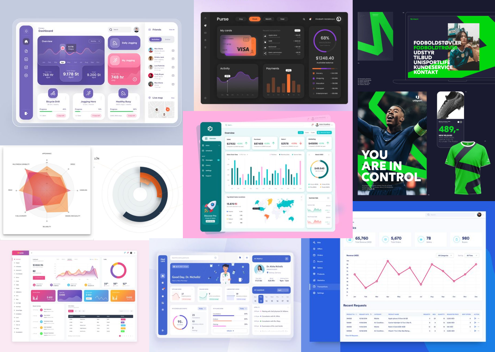
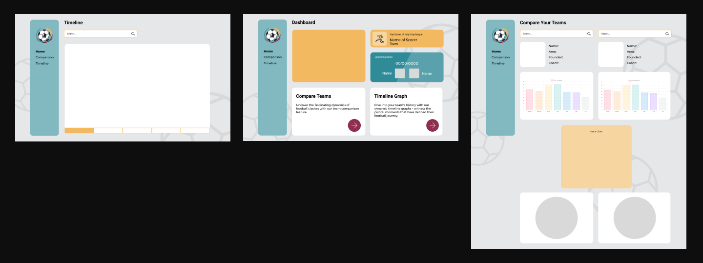

<!-- Repository Information & Links-->
 

<!-- HEADER SECTION -->
<h5 align="center" style="padding:0;margin:0;">Kayla Posthumus - 231096</h5>
<h6 align="center">DV200 Term 2</h6>
 

  
  
  <h3 align="center">FootStats</h3>

  

     Unlocking Insights, Empowering Decisions 
      <a href="https://github.com/KaylaPosthumusOW/Formative-Assessment_231096"><strong>Explore the docs »</strong></a>
    
    
   <a href="path/to/demonstration/video">View Demo</a>
    ·
    <a href="https://github.com/KaylaPosthumusOW/Formative-Assessment_231096">Report Bug</a>
    ·
    <a href="https://github.com/KaylaPosthumusOW/Formative-Assessment_231096">Request Feature</a>

<!-- TABLE OF CONTENTS -->
## Table of Contents

- [Table of Contents](#table-of-contents)
- [About the Project](#about-the-project)
  - [Project Description](#project-description)
  - [Built With](#built-with)
- [Getting Started](#getting-started)
  - [Prerequisites](#prerequisites)
  - [How to install](#how-to-install)
  - [Installation](#installation)
- [Features and Functionality](#features-and-functionality)
  - [Feature 1](#feature-1)
  - [Feature 2](#feature-2)
  - [Feature 3 - Standard User](#feature-3---standard-user)
  - [Feature 4 - Art House User](#feature-4---art-house-user)
  - [Feature 5 - Admin User](#feature-5---admin-user)
- [Concept Process](#concept-process)
  - [Ideation](#ideation)
  - [Wireframes](#wireframes)
  - [User-flow](#user-flow)
- [Development Process](#development-process)
  - [Implementation Process](#implementation-process)
    - [Highlights](#highlights)
    - [Challenges](#challenges)
  - [Future Implementation](#future-implementation)
- [Final Outcome](#final-outcome)
  - [Mockups](#mockups)
  - [Video Demonstration](#video-demonstration)
- [Roadmap](#roadmap)
- [Contributing](#contributing)
- [Authors](#authors)
- [License](#license)
- [Contact](#contact)
- [Acknowledgements](#acknowledgements)

This project was bootstrapped with [Create React App](https://github.com/facebook/create-react-app).

## Available Scripts

In the project directory, you can run:

### `npm start`

Runs the app in the development mode.\
Open [http://localhost:3000](http://localhost:3000) to view it in your browser.

The page will reload when you make changes.\
You may also see any lint errors in the console.

### `npm test`

Launches the test runner in the interactive watch mode.\
See the section about [running tests](https://facebook.github.io/create-react-app/docs/running-tests) for more information.

### `npm run build`

Builds the app for production to the `build` folder.\
It correctly bundles React in production mode and optimizes the build for the best performance.

The build is minified and the filenames include the hashes.\
Your app is ready to be deployed!

See the section about [deployment](https://facebook.github.io/create-react-app/docs/deployment) for more information.

### `npm run eject`

**Note: this is a one-way operation. Once you `eject`, you can't go back!**

If you aren't satisfied with the build tool and configuration choices, you can `eject` at any time. This command will remove the single build dependency from your project.

Instead, it will copy all the configuration files and the transitive dependencies (webpack, Babel, ESLint, etc) right into your project so you have full control over them. All of the commands except `eject` will still work, but they will point to the copied scripts so you can tweak them. At this point you're on your own.

You don't have to ever use `eject`. The curated feature set is suitable for small and middle deployments, and you shouldn't feel obligated to use this feature. However we understand that this tool wouldn't be useful if you couldn't customize it when you are ready for it.

## Learn More

You can learn more in the [Create React App documentation](https://facebook.github.io/create-react-app/docs/getting-started).

To learn React, check out the [React documentation](https://reactjs.org/).

### Code Splitting

This section has moved here: [https://facebook.github.io/create-react-app/docs/code-splitting](https://facebook.github.io/create-react-app/docs/code-splitting)

### Analyzing the Bundle Size

This section has moved here: [https://facebook.github.io/create-react-app/docs/analyzing-the-bundle-size](https://facebook.github.io/create-react-app/docs/analyzing-the-bundle-size)

### Making a Progressive Web App

This section has moved here: [https://facebook.github.io/create-react-app/docs/making-a-progressive-web-app](https://facebook.github.io/create-react-app/docs/making-a-progressive-web-app)

### Deployment

### Feature 2

The Comparison page is where two teams are compared using 3 charts; a bar graph, a radar chart and a pie chart. The user is able to choose 2 teams from a dropdown menu. Once the teams are chosen the team emblem and information as well as the bar graph is rendered. 
The user then chooses players from the chosen teams where a comparison between the 2 player are done using the Radar chart and the pie chart.

<!-- CONCEPT PROCESS -->
<!-- Briefly explain your concept ideation process -->

## Concept Process

The `Conceptual Process` is the set of actions, activities and research that was done when starting this project.

### Ideation

For the ideation we designed a mood board and also determined our colour palette and typography

### Wireframes

<!-- DEVELOPMENT PROCESS -->

Certainly! Here’s a filled-out version of the `Development Process` section:

---

## Development Process

The `Development Process` outlines the technical implementations and functionalities included in both the frontend and backend of the Exhibito application.

### Implementation Process

- **Project Setup and Environment Configuration**:
  - Initialize a new `React.js` project using tools like Create React App or set up manually.
  - Install `Axios` using npm or yarn to handle HTTP requests.
  - Install `Chart.js` library and configure it to create charts and graphs.
  - Add `Bootstrap` to the project for responsive layout and UI components.
  - Used `React Router` for seamless client-side routing.

- **Component Development**:
  - React Components: Create functional or class-based components to structure the UI.
  - Component Styling: Use CSS to style components, complemented by Bootstrap for responsive design
  - API Integration: Use `Axios` to fetch data from external APIs (like football data APIs) and manage state using React hooks like useState and useEffect.

- **Data Visualization**:
  - `Chart.js`: Implement various types of charts (e.g., bar charts, radar charts) to visualize data fetched from APIs.
  - Customization: Customize charts with options provided by Chart.js, such as colors, labels, tooltips, etc.

#### Highlights

- Designing my first react app was very fulfilling
- Integrating the API in a responsive way

#### Challenges

<!-- stipulated the challenges you faced with the project and why you think you faced it or how you think you'll solve it (if not solved) -->

- Figuring out how react works and how to implement routing in a new way.
- Finding and researching appropriate APIs

### Future Implementation

<!-- stipulate functionality and improvements that can be implemented in the future. -->

- Adding more animations and interactivity.

<!-- MOCKUPS -->

## Final Outcome

### Mockups

<!-- VIDEO DEMONSTRATION -->

### Video Demonstration

To see a run through of the application, click below:

[View Demonstration](https://drive.google.com/drive/folders/1OKNTZGA93za5IHH613BifTZkndk62LY-)

<!-- ROADMAP -->

## Roadmap

See the [open issues](https://github.com/KaylaPosthumusOW/Formative-Assessment_231096/issues) for a list of proposed features (and known issues).

<!-- CONTRIBUTING -->

## Contributing

Contributions are what makes the open-source community such an amazing place to learn, inspire, and create. Any contributions you make are **greatly appreciated**.

1. Fork the Project
2. Create your Feature Branch (`git checkout -b feature/AmazingFeature`)
3. Commit your Changes (`git commit -m 'Add some AmazingFeature'`)
4. Push to the Branch (`git push origin feature/AmazingFeature`)
5. Open a Pull Request

<!-- AUTHORS -->

## Authors

- **Kayla Posthumus** - [KaylaPosthumusOW](https://github.com/KaylaPosthumusOW)

<!-- LICENSE -->

## License

Distributed under the MIT License. See `LICENSE` for more information.\

<!-- LICENSE -->

## Contact

- **Kayla Posthumus** - [231096@virtualwindow.co.za](mailto:231096@virtualwindow.co.za)
<!-- ACKNOWLEDGEMENTS -->

This section has moved here: [https://facebook.github.io/create-react-app/docs/troubleshooting#npm-run-build-fails-to-minify](https://facebook.github.io/create-react-app/docs/troubleshooting#npm-run-build-fails-to-minify)
